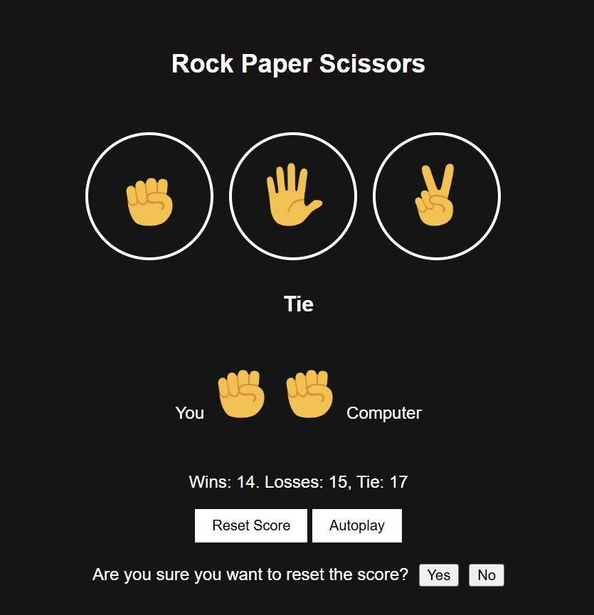

# Rock Paper Scissors Game

A simple and fun Rock Paper Scissors game built with HTML, CSS, and vanilla JavaScript.

## About This Project

This project was created as a learning exercise while working through the JavaScript tutorial by SuperSimpleDev. It was a great way to get hands-on experience with fundamental JavaScript concepts, DOM manipulation, and event handling.

The primary goal was to solidify understanding of JavaScript basics in a fun, interactive way.

Course: [SuperSimpleDev 24-hour JavaScript Course](https://www.youtube.com/@SuperSimpleDev)
Specific Video: [JavaScript Full Course for free  beginners to advanced (2024)](https://youtu.be/EerdGm-ehJQ?si=QyrpuI7kZWtkTDVK)

## Demo

## Features

*   Play Rock, Paper, or Scissors against the computer.
*   Keeps track of wins, losses, and ties using local storage.
*   Option to reset the score.
*   Autoplay feature.
*   Keyboard shortcuts:
    *   'r' for Rock
    *   'p' for Paper
    *   's' for Scissors
    *   'a' to toggle Autoplay
    *   'Backspace' to reset score (shows confirmation)

## Screenshots

  
  

## How to Play

1.  Open the `rock-with-css.html` file in your web browser.
2.  Click on the Rock, Paper, or Scissors buttons to make your choice.
3.  Alternatively, use the 'r', 'p', or 's' keys.
4.  The computer's move and the result will be displayed.
5.  Enjoy! 